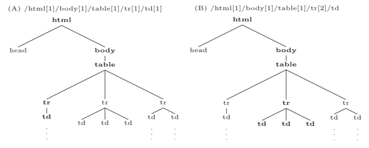

# Web extraction {#WebExtraction}


TODO: proposed time: 2 lectures

A large part of Web information extraction requires the knowledge of natural language processing techniques such as text pre-processing, information extraction (entity extraction, relationship extraction, coreference resolution), sentiment analysis, text categorization/classification (irbook 13), language models (irbook 12) and others. These techniques are covered by the selective Natural language processing course taught by prof. dr. Marko Robnik Šikonja. Therefore we introduce these techniques on a shallow level and rather focus on web-related extraction only. For introduction to natural language techniques please see the proposed literature [@liu2011] (Chapter 11), [@manning2008] (Chapters 12, 13, 15-17, 20), [@aggarwal2012] (Chapters 1-8, 12-14) or other specialized books on natural language processing.

The content in this section is largely combined from research paper [Web data extraction, applications and techniques: A survey](https://www.sciencedirect.com/science/article/pii/S0950705114002640) [@ferrara2014], TODO ...

There have also been some work done within the Faculty's bachelor or master theses:

* [Vmesnik za dostop do portala odprtih podatkov Slovenije (2018), Sašo Marić](https://plus.si.cobiss.net/opac7/bib/fkkri/1537726403)
* [Analiza dimenzij kakovosti informacij spletnih strani slovenskih podjetij (2016), Matic Jazbec](https://plus.si.cobiss.net/opac7/bib/fkkri/1537211331)
* [Zajem in obdelava podatkov s spleta (2015), Marko Balažic](https://plus.si.cobiss.net/opac7/bib/fkkri/1536570819)
* [Napredno iskanje nepremičnin (2014), Nina Žakelj](https://plus.si.cobiss.net/opac7/bib/fkkri/10715988)
* [Tehnike spletnega luščenja podatkov (2013), Peter Grlica](https://plus.si.cobiss.net/opac7/bib/fkkri/9990484)
* [Spletni iskalnik podatkov o osebah (2013), Matej Žniderič](https://plus.si.cobiss.net/opac7/bib/fkkri/10152276)
* [Delno samodejna izdelava ovojnic za spletne vire (2012), Rok Burgar](https://plus.si.cobiss.net/opac7/bib/fkkri/9454420)

## Web data extraction

Web Data Extraction systems are a broad class of software applications targeting at extracting data from Web sources. A Web Data Extraction system usually interacts with a Web source and extracts data stored in it: for instance, if the source is an HTML Web page, the extracted content could consist of elements in the page as well as the full-text of the page itself. Eventually, extracted data might be post-processed, converted in the most convenient structured format and stored for further usage.

Web Data Extraction systems find extensive use in a wide range of applications including the analysis of text-based documents available to a company (like e-mails, support forums, technical and legal documentation, and so on), Business and Competitive Intelligence, crawling of Social Web platforms, BioInformatics and so on. The importance of Web Data Extraction systems depends on the fact that a large (and steadily growing) amount of data is continuously produced, shared and consumed online: Web Data Extraction systems allow to efficiently collect these data with limited human effort. The availability and analysis of collected data is an indefeasible requirement to understand complex social, scientific and economic phenomena which generate the data. For example, collecting digital traces produced by users of Social Web platforms like Facebook, YouTube or Flickr is the key step to understand, model and predict human behavior.

In the commercial field, the Web provides a wealth of public domain information. A company can probe the Web to acquire and analyze information about the activity of its competitors. This process is known as Competitive Intelligence and it is crucial to quickly identify the opportunities provided by the market, to anticipate the decisions of the competitors as well as to learn from their faults and successes.

The design and implementation of Web Data Extraction systems has been discussed from different perspectives and it leverages on scientific methods coming from various disciplines including Machine Learning, Logic and Natural Language Processing.

In the design of a Web Data Extraction system, many factors must be taken into account; some of them are independent of the specific application domain in which we plan to perform Web Data Extraction. Other factors, instead, heavily depend on the particular features of the application domain: as a consequence, some technological solutions which appear to be effective in some application contexts are not suitable in others.

In its most general formulation, the problem of extracting data from the Web is hard because it is constrained by several requirements. The key challenges we can encounter in the design of a Web Data Extraction system can be summarized as follows:

* Web Data Extraction techniques implemented in a Web Data Extraction system often require the help of human experts. A first challenge consists of providing a high degree of automation by reducing human efforts as much as possible. Human feedback, however, may play an important role in raising the level of accuracy achieved by a Web Data Extraction system.
A related challenge is, therefore, to identify a reasonable tradeoff between the need of building highly automated Web Data Extraction procedures and the requirement of achieving accurate performance.
* Web Data Extraction techniques should be able to process large volumes of data in relatively short time. This requirement is particularly stringent in the field of Business and Competitive Intelligence because a company needs to perform timely analysis of market conditions.
* Applications in the field of Social Web or, more in general, those dealing with personal data must provide solid privacy guarantees. Therefore, potential (even if unintentional) attempts to violate user privacy should be timely and adequately identified and counteracted.
* Approaches relying on Machine Learning often require a significantly large training set of manually labeled Web pages. In general, the task of labeling pages is time-expensive and error-prone and, therefore, in many cases we cannot assume the existence of labeled pages.
* Oftentimes, a Web Data Extraction tool has to routinely extract data from a Web Data source which can evolve over time. Web sources are continuously evolving and structural changes happen with no forewarning, thus are unpredictable. Eventually, in real-world scenarios it emerges the need of maintaining these systems, that might stop working correctly if lacking of flexibility to detect and face structural modifications of related Web sources.

### Techniques

In this part we extensively review approaches to extracting data from HTML pages. HTML is the predominant language for implementing Web pages and it is largely supported by W3C consortium. HTML pages can be regarded as a form of semi-structured data (even if less structured than other sources like XML documents) in which information follows a nested structure; HTML features can be profitably used in the design of suitable wrappers. However, we acknowledge that a large amount of semi-structured information is present in non-HTML formats (think of e-mail messages, software code and related documentations, system logs and so on) but the research approaches targeting at extracting information from this type of sources are out of the scope of this work.

The first attempts to extract data from the Web are dated back in early nineties. In the early days, this discipline borrowed approaches and techniques from Information Extraction (IE) literature. In particular, two classes of strategies emerged: *learning techniques* and *knowledge engineering techniques* – also called *learning-based* and *rule-based approaches*, respectively. These classes share a common rationale: the former was thought to develop systems that require human expertise to define rules (for example, *regular expressions*) to successfully accomplish the data extraction. These approaches require specific domain expertise: users that design and implement the rules and train the system must have programming experience and a good knowledge of the domain in which the data extraction system will operate; they will also have the ability to envisage potential usage scenarios and tasks assigned to the system. On the other hand, also some approaches of the latter class involve strong familiarity with both the requirements and the functions of the platform, so the human engagement is essential.

Various strategies have been devised to reduce the commitment of human domain experts. Some of them have been developed in the context of Artificial Intelligence literature, like the adoption of specific algorithms that use the structure of Web pages to identify and extract data. Others methods are borrowed from Machine Learning, like supervised or semi-supervised learning techniques to design systems capable of being trained by examples and then able to autonomously extract data from similar (or even different) domains.

#### Tree-based techniques

One of the most exploited features in Web Data Extraction is the semi-structured nature of Web pages. These can be naturally represented as labeled ordered rooted trees, where labels represent the tags proper of the HTML mark-up language syntax, and the tree hierarchy represents the different levels of nesting of elements constituting the Web page. The representation of a Web page by using a labeled ordered rooted tree is usually referred as DOM (Document Object Model), whose detailed explanation is out of the scope of this survey but has been largely regulated by the World Wide Web Consortium. The general idea behind the Document Object Model is that HTML Web pages are represented by means of plain text that contains HTML tags, particular keywords defined in the mark-up language, which can be interpreted by the browser to represent the elements specific of a Web page (e.g., hyper-links, buttons, images and so forth), so as free-text. HTML tags may be nested one into another, forming a hierarchical structure. This hierarchy is captured in the DOM by the document tree whose nodes represent HTML tags. The document tree (henceforth also referred as DOM tree) has been successfully exploited for Web Data Extraction purposes in a number of techniques discussed in the following.

##### Addressing elements in the document tree: XPath

One of the main advantage of the adoption of the Document Object Model for Web Content Extraction is the possibility of exploiting some tools typical of XML languages (and HTML is to all effects a dialect of the XML). In particular, the XML Path Language (or, briefly, XPath) provides with a powerful syntax to address specific elements of an XML document (and, to the same extent, of HTML Web pages) in a simple manner. XPath has been defined by the World Wide Web Consortium, so as [DOM](http://www.w3.org/DOM).

Although describing the syntax of XPath is not the core argument of this section, we provide Figure \@ref(fig:xpath-extraction) as an example to explain how XPath can be used to address elements of a Web page. There exist two possible ways to use XPath: *(i)* to identify a single element in the document tree, or *(ii)* to address multiple occurrences of the same element. In the former case, illustrated in Figure \@ref(fig:xpath-extraction)(A), the defined XPath identifies just a single element on the Web page (namely, a table cell); in the latter, showed in Figure \@ref(fig:xpath-extraction)(B), the XPath identifies multiple instances of the same type of element (still a table cell) sharing the same hierarchical location.

```{r xpath-extraction, echo=FALSE, fig.align="center", fig.cap="Example of XPath(s) on the document tree, selecting one (A) or multiple (B) items."}

```

To the purpose of Web Data Extraction, the possibility of exploiting such a powerful tool has been of utmost importance: the adoption of XPath as the tool to address elements in Web page has been largely exploited in the literature. The major weakness of XPath is related to its lack of flexibility: each XPath expression is strictly related to the structure of the Web page on top of which it has been defined. However, this limitation has been partially mitigated, by introducing relative path expressions, in latest releases.3 In general, even minor changes to the structure of a Web page might corrupt the correct functioning of an XPath expression defined on a previous version of the page.

To better clarify this concept, let us consider Web pages generated by a script (e.g., think of the information about a book in an e-commerce Web site). Now assume that the script undergoes some change: we can expect that the tree structure of the HTML page generated by that script will change accordingly. To keep the Web Data Extraction process functional, one should update the expression every time any change occurs to the underlying page generation model; such an operation would require a high human commitment and, therefore, its cost could be prohibitively large. To this purpose, some authors introduced the concept of *wrapper robustness*: they proposed a strategy to find, among all the XPath expressions capable of extracting the same information from a Web page, the one that is less influenced by potential changes in the structure of the page and such an expression identifies the more robust wrapper. In general, to make the whole Web Data Extraction process robust, we need suitable tools allowing us to measure the similarity degree of two documents; such a task can be accomplished by detecting structural variations in the DOM trees associated with the documents. To this extent, some techniques, called tree-matching strategies are a good candidate to detect similarities between two trees and they will be discussed in detail in the next sections.

##### Tree edit distance matching algorithms

The first technique we describe is called tree edit distance matching. The problem of computing the tree edit distance between trees is a variation of the classic string edit distance problem. Given two labeled ordered rooted trees $A$ and $B$, the problem is to finding a sequence of operations to transform $A$ into $B$ (or the vice versa) with the minimum number of operations. The set of possible operations consists of node deletion, insertion or replacement. At each operation might be applied a cost, and in that case, the task turns in a cost-minimization problem (i.e., finding the sequence of operations of minimum cost to transform $A$ into $B$).

The reasoning above is formally encoded in the definition of *mapping*. A mapping $M$ between two trees $A$ and $B$ is defined as a set of ordered pairs $(i.j)$, one from each tree, satisfying the following conditions $\forall (i_1,j_1), (i_2,j_2) \in M$:

1. $i_1 = i_2$ if and only if $j_1 = j_2$;
2. $A[i_1]$ is on the left of $A[i_2]$ if and only if $B[i_1]$ is on the left of $B[i_2]$;
3. $A[i_1]$ is an ancestor of $A[i_2]$ if and only if $B[i_1]$ is an ancestor of $B[i_2]$.


With the notation $A[i_x]$  we indicate the $x$-th node of the tree $A$ in a *pre-order* visit of the tree. A number of consequences emerge from this definition of mapping:

* Each node must appear no more than once in a mapping.
* The order among siblings is preserved.
* The hierarchical relations among nodes is unchanged.

A number of techniques to approach this problem have been proposed. These methods support all three types of operations on nodes (i.e., node deletion, insertion and replacement) but are plagued by high computational costs. It has also been proved that the formulation for non ordered trees is NP-complete.

###### The simple tree matching algorithm

A computationally efficient solution for the problem of the tree edit distance matching is provided by the algorithm called *simple tree matching* [@selkow1977], and its variants. This optimized strategy comes at a cost: node replacement is not allowed during the matching procedure – the shortcomings of this aspects will be further discussed below. The pseudo-code of the simple tree matching algorithm is provided in TODO REF, which adopts the following notation: $d(n)$ represents the degree of a node $n$ (i.e., the number of first-level children); $T(i)$ is the i-th subtree of the tree rooted at node $T$.

```{r simple-tree-algorithm, echo=FALSE, fig.align="center", fig.width=13, fig.cap="Simple tree matching algorithm."}
knitr::include_graphics("tex/extraction/simpleTreeMatching.pdf")
```


#### Web wrappers

#### Hybrid systems: learning-based wrapper generation


------

TODO: Paper: A Survey of Unsupervised Techniques for Web Data Extraction

TODO: Paper: On learning web information extraction rules with TANGO

### Document parsing

CS371R - Information extraction.ppt

Introduction of XML, JSON formats. Parsing of tables, links, emails, ... Show examples of web pages... Small part of this should already be shown at the crawling step.

CS371R - Text properties.ppt

### Association rules and sequential patterns

chapter 2

### Wrapper generation

Chapter 9

### Ontology-based information extraction

## Information integration

Entity resolution, data deduplication techniques, ...

## Text summarization

Book Mining Text Data, chapter 3

https://www.researchgate.net/publication/264876513_Query-Based_Summarization_A_survey

http://ieeexplore.ieee.org/document/7377323/

## Mining text streams

Book Mining Text Data, chapter 9

## Text mining in multimedia

Book Mining Text Data, chapter 11

## Literatura

Knjiga:

* [Web Scraping with Python (2015), Ryan Mitchell](https://www.amazon.de/Web-Scraping-Python-Ryan-Mitchell/dp/1491910291)
