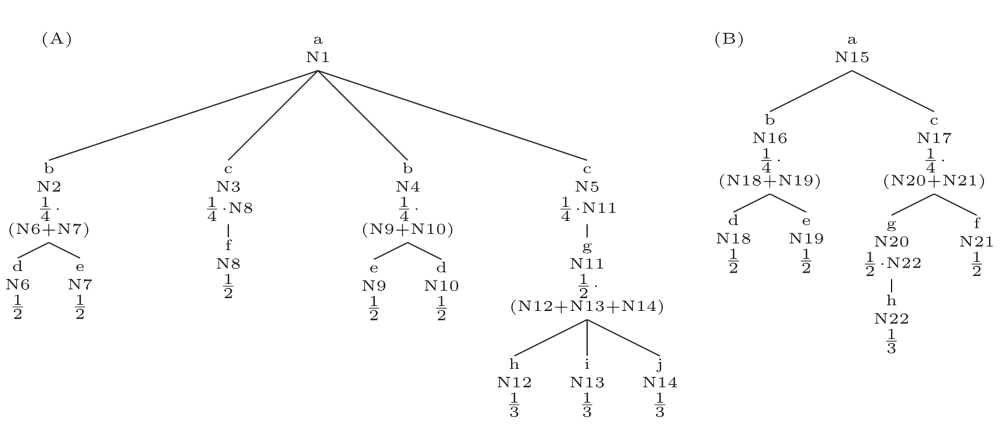
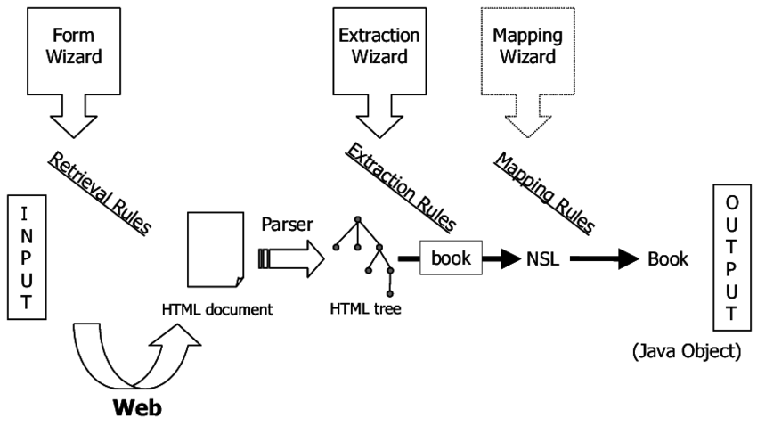
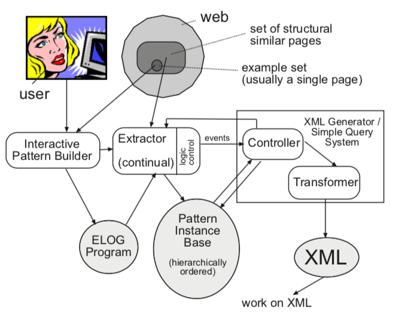
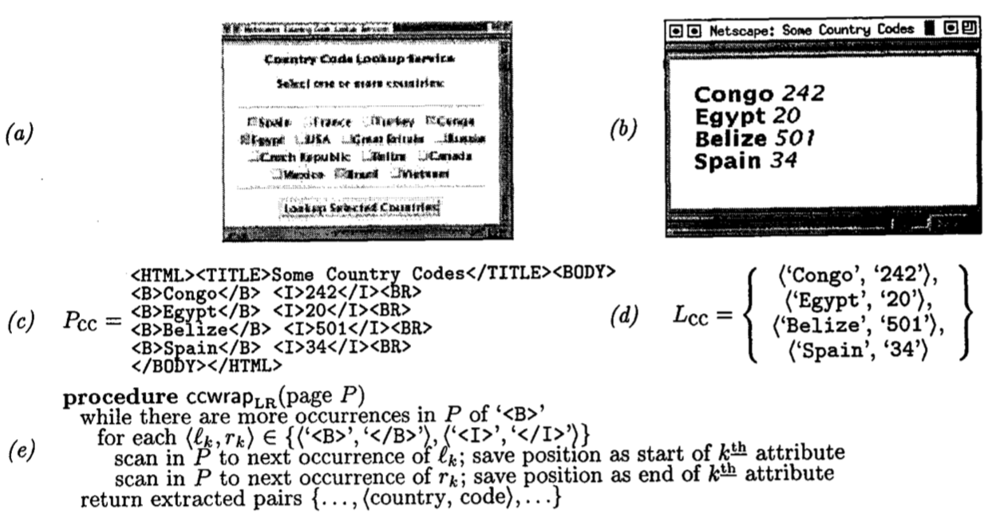
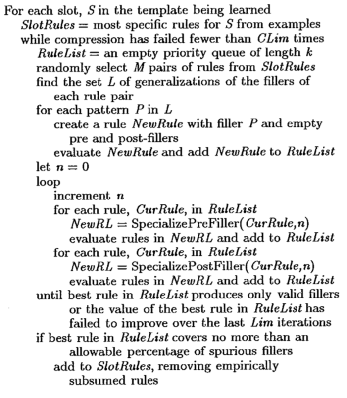
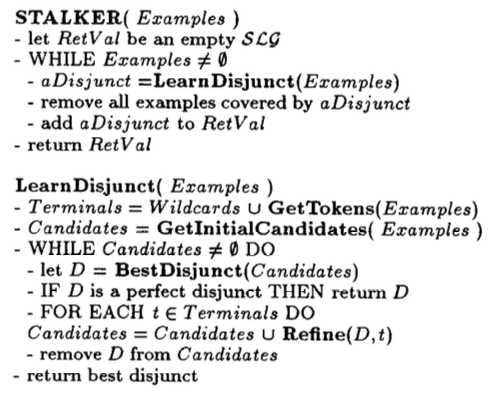

# Web extraction {#WebExtraction}


TODO: proposed time: 2 lectures ??

A large part of Web information extraction requires the knowledge of natural language processing techniques such as text pre-processing, information extraction (entity extraction, relationship extraction, coreference resolution), sentiment analysis, text categorization/classification (irbook 13), language models (irbook 12) and others. These techniques are covered by the selective Natural language processing course taught by prof. dr. Marko Robnik Šikonja. Therefore we introduce these techniques on a shallow level and rather focus on web-related extraction only. For introduction to natural language techniques please see the proposed literature [@liu2011] (Chapter 11), [@manning2008] (Chapters 12, 13, 15-17, 20), [@aggarwal2012] (Chapters 1-8, 12-14) or other specialized books on natural language processing.

The content in this section is largely combined from research paper [Web data extraction, applications and techniques: A survey](https://www.sciencedirect.com/science/article/pii/S0950705114002640) [@ferrara2014], **TODO ...**

There have also been some work done within the Faculty's bachelor or master theses:

* [Vmesnik za dostop do portala odprtih podatkov Slovenije (2018), Sašo Marić](https://plus.si.cobiss.net/opac7/bib/fkkri/1537726403)
* [Analiza dimenzij kakovosti informacij spletnih strani slovenskih podjetij (2016), Matic Jazbec](https://plus.si.cobiss.net/opac7/bib/fkkri/1537211331)
* [Zajem in obdelava podatkov s spleta (2015), Marko Balažic](https://plus.si.cobiss.net/opac7/bib/fkkri/1536570819)
* [Napredno iskanje nepremičnin (2014), Nina Žakelj](https://plus.si.cobiss.net/opac7/bib/fkkri/10715988)
* [Tehnike spletnega luščenja podatkov (2013), Peter Grlica](https://plus.si.cobiss.net/opac7/bib/fkkri/9990484)
* [Spletni iskalnik podatkov o osebah (2013), Matej Žniderič](https://plus.si.cobiss.net/opac7/bib/fkkri/10152276)
* [Delno samodejna izdelava ovojnic za spletne vire (2012), Rok Burgar](https://plus.si.cobiss.net/opac7/bib/fkkri/9454420)

## Web data extraction

Web Data Extraction systems are a broad class of software applications targeting at extracting data from Web sources. A Web Data Extraction system usually interacts with a Web source and extracts data stored in it: for instance, if the source is an HTML Web page, the extracted content could consist of elements in the page as well as the full-text of the page itself. Eventually, extracted data might be post-processed, converted in the most convenient structured format and stored for further usage.

Web Data Extraction systems find extensive use in a wide range of applications including the analysis of text-based documents available to a company (like e-mails, support forums, technical and legal documentation, and so on), Business and Competitive Intelligence, crawling of Social Web platforms, BioInformatics and so on. The importance of Web Data Extraction systems depends on the fact that a large (and steadily growing) amount of data is continuously produced, shared and consumed online: Web Data Extraction systems allow to efficiently collect these data with limited human effort. The availability and analysis of collected data is an indefeasible requirement to understand complex social, scientific and economic phenomena which generate the data. For example, collecting digital traces produced by users of Social Web platforms like Facebook, YouTube or Flickr is the key step to understand, model and predict human behavior.

In the commercial field, the Web provides a wealth of public domain information. A company can probe the Web to acquire and analyze information about the activity of its competitors. This process is known as Competitive Intelligence and it is crucial to quickly identify the opportunities provided by the market, to anticipate the decisions of the competitors as well as to learn from their faults and successes.

The design and implementation of Web Data Extraction systems has been discussed from different perspectives and it leverages on scientific methods coming from various disciplines including Machine Learning, Logic and Natural Language Processing.

In the design of a Web Data Extraction system, many factors must be taken into account; some of them are independent of the specific application domain in which we plan to perform Web Data Extraction. Other factors, instead, heavily depend on the particular features of the application domain: as a consequence, some technological solutions which appear to be effective in some application contexts are not suitable in others.

In its most general formulation, the problem of extracting data from the Web is hard because it is constrained by several requirements. The key challenges we can encounter in the design of a Web Data Extraction system can be summarized as follows:

* Web Data Extraction techniques implemented in a Web Data Extraction system often require the help of human experts. A first challenge consists of providing a high degree of automation by reducing human efforts as much as possible. Human feedback, however, may play an important role in raising the level of accuracy achieved by a Web Data Extraction system.
A related challenge is, therefore, to identify a reasonable tradeoff between the need of building highly automated Web Data Extraction procedures and the requirement of achieving accurate performance.
* Web Data Extraction techniques should be able to process large volumes of data in relatively short time. This requirement is particularly stringent in the field of Business and Competitive Intelligence because a company needs to perform timely analysis of market conditions.
* Applications in the field of Social Web or, more in general, those dealing with personal data must provide solid privacy guarantees. Therefore, potential (even if unintentional) attempts to violate user privacy should be timely and adequately identified and counteracted.
* Approaches relying on Machine Learning often require a significantly large training set of manually labeled Web pages. In general, the task of labeling pages is time-expensive and error-prone and, therefore, in many cases we cannot assume the existence of labeled pages.
* Oftentimes, a Web Data Extraction tool has to routinely extract data from a Web Data source which can evolve over time. Web sources are continuously evolving and structural changes happen with no forewarning, thus are unpredictable. Eventually, in real-world scenarios it emerges the need of maintaining these systems, that might stop working correctly if lacking of flexibility to detect and face structural modifications of related Web sources.

### Techniques

In this part we extensively review approaches to extracting data from HTML pages. HTML is the predominant language for implementing Web pages and it is largely supported by W3C consortium. HTML pages can be regarded as a form of semi-structured data (even if less structured than other sources like XML documents) in which information follows a nested structure; HTML features can be profitably used in the design of suitable wrappers. However, we acknowledge that a large amount of semi-structured information is present in non-HTML formats (think of e-mail messages, software code and related documentations, system logs and so on) but the research approaches targeting at extracting information from this type of sources are out of the scope of this work.

The first attempts to extract data from the Web are dated back in early nineties. In the early days, this discipline borrowed approaches and techniques from Information Extraction (IE) literature. In particular, two classes of strategies emerged: *learning techniques* and *knowledge engineering techniques* – also called *learning-based* and *rule-based approaches*, respectively. These classes share a common rationale: the former was thought to develop systems that require human expertise to define rules (for example, *regular expressions*) to successfully accomplish the data extraction. These approaches require specific domain expertise: users that design and implement the rules and train the system must have programming experience and a good knowledge of the domain in which the data extraction system will operate; they will also have the ability to envisage potential usage scenarios and tasks assigned to the system. On the other hand, also some approaches of the latter class involve strong familiarity with both the requirements and the functions of the platform, so the human engagement is essential.

Various strategies have been devised to reduce the commitment of human domain experts. Some of them have been developed in the context of Artificial Intelligence literature, like the adoption of specific algorithms that use the structure of Web pages to identify and extract data. Others methods are borrowed from Machine Learning, like supervised or semi-supervised learning techniques to design systems capable of being trained by examples and then able to autonomously extract data from similar (or even different) domains.

#### Tree-based techniques

One of the most exploited features in Web Data Extraction is the semi-structured nature of Web pages. These can be naturally represented as labeled ordered rooted trees, where labels represent the tags proper of the HTML mark-up language syntax, and the tree hierarchy represents the different levels of nesting of elements constituting the Web page. The representation of a Web page by using a labeled ordered rooted tree is usually referred as DOM (Document Object Model), whose detailed explanation is out of the scope of this survey but has been largely regulated by the World Wide Web Consortium. The general idea behind the Document Object Model is that HTML Web pages are represented by means of plain text that contains HTML tags, particular keywords defined in the mark-up language, which can be interpreted by the browser to represent the elements specific of a Web page (e.g., hyper-links, buttons, images and so forth), so as free-text. HTML tags may be nested one into another, forming a hierarchical structure. This hierarchy is captured in the DOM by the document tree whose nodes represent HTML tags. The document tree (henceforth also referred as DOM tree) has been successfully exploited for Web Data Extraction purposes in a number of techniques discussed in the following.

##### Addressing elements in the document tree: XPath

One of the main advantage of the adoption of the Document Object Model for Web Content Extraction is the possibility of exploiting some tools typical of XML languages (and HTML is to all effects a dialect of the XML). In particular, the XML Path Language (or, briefly, XPath) provides with a powerful syntax to address specific elements of an XML document (and, to the same extent, of HTML Web pages) in a simple manner. XPath has been defined by the World Wide Web Consortium, so as [DOM](http://www.w3.org/DOM).

Although describing the syntax of XPath is not the core argument of this section, we provide Figure \@ref(fig:xpath-extraction) as an example to explain how XPath can be used to address elements of a Web page. There exist two possible ways to use XPath: *(i)* to identify a single element in the document tree, or *(ii)* to address multiple occurrences of the same element. In the former case, illustrated in Figure \@ref(fig:xpath-extraction)(A), the defined XPath identifies just a single element on the Web page (namely, a table cell); in the latter, showed in Figure \@ref(fig:xpath-extraction)(B), the XPath identifies multiple instances of the same type of element (still a table cell) sharing the same hierarchical location.

```{r xpath-extraction, echo=FALSE, fig.align="center", fig.cap="Example of XPath(s) on the document tree, selecting one (A) or multiple (B) items."}
knitr::include_graphics("img/extraction/xpath.png")
```

To the purpose of Web Data Extraction, the possibility of exploiting such a powerful tool has been of utmost importance: the adoption of XPath as the tool to address elements in Web page has been largely exploited in the literature. The major weakness of XPath is related to its lack of flexibility: each XPath expression is strictly related to the structure of the Web page on top of which it has been defined. However, this limitation has been partially mitigated, by introducing relative path expressions, in latest releases.3 In general, even minor changes to the structure of a Web page might corrupt the correct functioning of an XPath expression defined on a previous version of the page.

To better clarify this concept, let us consider Web pages generated by a script (e.g., think of the information about a book in an e-commerce Web site). Now assume that the script undergoes some change: we can expect that the tree structure of the HTML page generated by that script will change accordingly. To keep the Web Data Extraction process functional, one should update the expression every time any change occurs to the underlying page generation model; such an operation would require a high human commitment and, therefore, its cost could be prohibitively large. To this purpose, some authors introduced the concept of *wrapper robustness*: they proposed a strategy to find, among all the XPath expressions capable of extracting the same information from a Web page, the one that is less influenced by potential changes in the structure of the page and such an expression identifies the more robust wrapper. In general, to make the whole Web Data Extraction process robust, we need suitable tools allowing us to measure the similarity degree of two documents; such a task can be accomplished by detecting structural variations in the DOM trees associated with the documents. To this extent, some techniques, called tree-matching strategies are a good candidate to detect similarities between two trees and they will be discussed in detail in the next sections.

##### Tree edit distance matching algorithms {#tree-edit-distance}

The first technique we describe is called tree edit distance matching. The problem of computing the tree edit distance between trees is a variation of the classic string edit distance problem. Given two labeled ordered rooted trees $A$ and $B$, the problem is to finding a sequence of operations to transform $A$ into $B$ (or the vice versa) with the minimum number of operations. The set of possible operations consists of node deletion, insertion or replacement. At each operation might be applied a cost, and in that case, the task turns in a cost-minimization problem (i.e., finding the sequence of operations of minimum cost to transform $A$ into $B$).

The reasoning above is formally encoded in the definition of *mapping*. A mapping $M$ between two trees $A$ and $B$ is defined as a set of ordered pairs $(i.j)$, one from each tree, satisfying the following conditions $\forall (i_1,j_1), (i_2,j_2) \in M$:

1. $i_1 = i_2$ if and only if $j_1 = j_2$;
2. $A[i_1]$ is on the left of $A[i_2]$ if and only if $B[i_1]$ is on the left of $B[i_2]$;
3. $A[i_1]$ is an ancestor of $A[i_2]$ if and only if $B[i_1]$ is an ancestor of $B[i_2]$.


With the notation $A[i_x]$  we indicate the $x$-th node of the tree $A$ in a *pre-order* visit of the tree. A number of consequences emerge from this definition of mapping:

* Each node must appear no more than once in a mapping.
* The order among siblings is preserved.
* The hierarchical relations among nodes is unchanged.

A number of techniques to approach this problem have been proposed. These methods support all three types of operations on nodes (i.e., node deletion, insertion and replacement) but are plagued by high computational costs. It has also been proved that the formulation for non ordered trees is NP-complete.

###### The simple tree matching algorithm

A computationally efficient solution for the problem of the tree edit distance matching is provided by the algorithm called *simple tree matching* [@selkow1977], and its variants. This optimized strategy comes at a cost: node replacement is not allowed during the matching procedure – the shortcomings of this aspects will be further discussed below. The pseudo-code of the simple tree matching algorithm is provided in Algorithm \@ref(fig:simple-tree-algorithm), which adopts the following notation: $d(n)$ represents the degree of a node $n$ (i.e., the number of first-level children); $T(i)$ is the i-th subtree of the tree rooted at node $T$.

```{r simple-tree-algorithm, echo=FALSE, fig.align="center", fig.cap="Simple tree matching algorithm."}
knitr::include_graphics("tex/extraction/simpleTreeMatching.pdf")
```

The computational cost of simple tree matching is $O(nodes(A) \cdot nodes(B))$, where $nodes(T)$ is the function that returns the number of nodes in a tree (or a sub-tree) $T$; the low cost ensures excellent performance when applied to HTML trees, which might be rich of nodes. Two main limitations hold with this algorithm:

* It cannot match permutation of nodes.
* No level crossing is allowed (it is impossible to match nodes at different hierarchical levels).

Despite these intrinsic limits, this technique appears to fit very well to the purpose of matching HTML trees in the context of Web Data Extraction. In fact, it has been adopted in several scenarios - matching using edit distance calculation, web data extraction, self-repairable web wrappers generation, news and blogs data extraction. One of the first Web Data Extraction approaches based on a tree edit distance algorithm is due to Reis et al. [@reis2004]. Such an approach focused on a very specific application domain (i.e., news extraction from the Web) but it was general enough to be re-applied in other domains. The algorithm of Reis et al. relies on a different definition of mapping called Restricted Top-Down Mapping (RTDM). In this model, insertion, removal and replacement operations are allowed only to the leaves of the trees. The restricted top-down edit distance between two trees $A$ and $B$ is defined as the cost of the restricted top-down mapping between the two trees. To find the restricted top-down mapping between two trees $A$ and $B$, the Yang’s algorithm is applied [@yang1991]. The worst case time complexity of the approach is still $O(nodes(A) \cdot nodes(B))$ but, as shown by the authors, it works much faster because only restricted top-down mappings are managed. A normalized variant of the simple tree matching is called normalized simple tree matching. The normalization is computed as follows


$$
NSTM(A,B) = \frac{SimpleTreeMatching(A,B)}{(nodes(A)+nodes(B))/2}.
$$

The tree Matching algorithm and its variants are widely used in practice because they are easy to implement.

###### The weighted tree matching algorithm

Another variant of the simple tree matching is discussed in the following, and is called *weighted tree matching*. It adjusts the similarity values provided by the original simple tree matching by introducing a renormalization factor. The pseudo-code of the weighted tree matching, presented in [@ferrara2011], is reported in Algorithm \@ref(fig:weighted-tree-algorithm).

```{r weighted-tree-algorithm, echo=FALSE, fig.align="center", fig.cap="Weighted tree matching algorithm."}
knitr::include_graphics("tex/extraction/weightedTreeMatching.pdf")
```

In Algorithm \@ref(fig:weighted-tree-algorithm), the notation $t(n)$ represents the number of total siblings of a node $n$ including itself. Note that Algorithm \@ref(fig:weighted-tree-algorithm) reports the differential version with respect to the simple tree matching described in Algorithm \@ref(fig:simple-tree-algorithm). The advantage of the weighted tree matching is that it better reflects a measure of similarity between two trees. In fact, in the simple tree matching algorithm the assigned matching value is always equal to one. Instead, the weighted tree matching algorithm assumes that less importance (i.e., a lower weight) is assigned to changes in the structure of the tree, when they occur in deeper sub-levels. This kind of changes can be, for example, missing or added leaves, truncated or added branches, etc. Also, a lower weight is accounted when changes occur in sub-levels with many nodes. The weighted tree matching algorithm returns a value in the interval $[0,1]$ and the closer to 1 the final value, the more similar the two input trees.

Let us analyze the behavior of the algorithm with an example often used in the literature to explain the simple tree matching (see Figure \@ref(fig:weighted-tree-algorithm-example)). In that figure, A and B are two very simple generic rooted labeled trees (i.e., the same structure of HTML document trees). They show several similarities except for some missing nodes/branches. By applying the weighted tree matching algorithm, a value of $\frac{1}{3}$ is established for nodes (h), (i) and (j) belonging to A, although two of them are missing in B. Going up to parents, the summation of contributions of matching leaves is multiplied by the relative value of each node (e.g., in the first sub-level, the contribution of each node is $\frac{1}{4}$ because of the four first-sublevel nodes in A). Once completed these operations for all nodes of the sub-level, values are added and the final measure of similarity for the two trees is obtained.

In this example, the weighted tree matching between A and B returns a measure of similarity of $\frac{3}{8}$ (0.375) whereas the simple tree matching would return 7. The main difference on results provided by these two algorithms is the following: the weighted tree matching intrinsically produces a proper measure of similarity between the two compared trees while the simple tree matching returns the mapping value. A remarkable feature of the weighted tree matching algorithm is that, the more the structure of considered trees is complex and similar, the more the measure of similarity will be accurate.

```{r weighted-tree-algorithm-example, echo=FALSE, fig.align="center", fig.cap="Example of application of the weighted tree matching algorithm for the comparison of two labeled rooted trees, A and B."}

```

#### Web wrappers

In the previous section we discussed some algorithms exploiting the semi-structured format of HTML documents. In the following we will discuss those procedures that might adopt the techniques presented above to carry out the data extraction.

In the literature, any procedure that aims at extracting structure data from unstructured (or semi-structured) data sources is usually referred as wrapper. In the context of Web Data Extraction we provide the following definition:

> **Web wrapper** is a procedure, that might implement one or many different classes of algorithms, which seeks and finds data required by a human user, extracting them from unstructured (or semi-structured) Web sources, and transforming them into structured data, merging and unifying this information for further processing, in a semi-automatic or fully automatic way.

Web wrappers are characterized by a life-cycle constituted by several steps:

1. *Wrapper generation*: the wrapper is defined according to some technique(s).
2. *Wrapper execution*: the wrapper runs and extracts data continuously.
3. *Wrapper maintenance*: the structure of data sources may change and the wrapper should be adapted accordingly to keep working properly.

In particular, the first two steps of a wrapper life-cycle, generation and execution (discussed in [Wrapper generation and execution](#wrapper-generation-execution)), might be implemented manually, for example by defining and executing regular expressions over the HTML documents. Alterna- tively, which is the aim of Web Data Extraction systems, wrappers might be defined and executed by using an inductive approach – a process commonly known as wrapper induction [@kushmerick1997]. Web wrapper induction is challenging because it requires high level automation strategies. There exist also hybrid approaches that make possible for users to generate and run wrappers semi-automatically by means of visual interfaces.

The last step of a wrapper life-cycle is the maintenance: Web pages change their structure continuously and without forewarning. This might corrupt the correct functioning of a Web wrapper, whose definition is usually tightly bound to the structure of the Web pages adopted for its generation. Defining automatic strategies for wrapper maintenance is of outstanding importance to guarantee correctness of extracted data and robustness of Web Data Extraction platforms. Some methodologies have been recently presented in the literature, as discussed in [The problem of wrapper maintenance](#wrapper-maintenance).

##### Wrapper generation and execution {#wrapper-generation-execution}

The first step in wrappers life-cycle is their generation. Early Web Data Extraction platforms provided only support for manual generation of wrappers, which required human expertise and skills in programming languages to write scripts able to identify and extract selected pieces of information within a Web page.

In late nineties they made their appearance more advanced Web Data Extraction systems. The core feature provided was the possibility for their users to define and execute Web wrappers by means of interactive graphical users interfaces (GUIs). In most cases, it was not required any deep understanding of a wrapper programming language, as wrappers were generated automatically (or semi-automatically) by the system exploiting directives given by users by means of the platform interface.

In the following we discuss in detail four types of rationales underlying these kind of platforms, namely regular expressions, logic-based approach, tree-based approach and machine learning approach. The details regarding the features of different Web Data Extraction platforms, instead, will be described in great detail in [Web data extraction systems](#extraction-systems).

###### Regular expression-based approach

One of the most common approaches is based on regular expressions, which are a powerful formal language used to identify strings or patterns in unstructured text on the basis of some matching criteria. Rules could be complex so, writing them manually, could require much time and a great expertise: wrappers based on regular expressions dynamically generate rules to extract desired data from Web pages. Usually, writing regular expressions on HTML pages relies on the following criteria: word boundaries, HTML tags, tables structure, etc. The advantage of platforms relying on regular expressions is that the user can usually select (for example by means of a graphical interface) one (or multiple) element(s) in a Web page, and the system is able to automatically infer the appropriate regular expression to identify that element in the page. Then, a wrapper might be created so that to extract similar elements, from other Web pages with the same structure of the one adopted to infer the regular expressions.

A notable tool implementing regular-expression-based extraction is W4F [@sahuguet1999] (Figure \@ref(fig:w4f)). W4F adopts an annotation approach: instead of challenging users to deal with the HTML documents syntax, W4F eases the design of the wrapper by means of a wizard procedure. This wizard allows users to select and annotate elements directly on the Web page. W4F produces the regular expression extraction rules of the annotated items and provides them to users. A further step, which is the optimization of the regular expressions generated by W4F, is delegated to expert users – in fact, the tool is not always able to provide the best extraction rule. By fully exploiting the power of regular expressions, W4F extraction rules include match and also split expressions, which separates words, annotating different elements on the same string. The drawback of the adoption of regular expressions is their lack of flexibility. For example, whenever even a minor change occurs in the structure or content of a Web page, each regular expression is very likely to stop working, and must be rewritten. This process implies a big commitment by human users, in particular in the maintenance of systems based on regular expressions. For this reason, more flexible and powerful languages have been developed to empower the capabilities of Web Data Extraction platforms.

```{r w4f, echo=FALSE, fig.align="center", fig.cap="Overview of the Lixto System."}

```

###### Logic-based approach
One example of powerful languages developed for data extraction purposes comes from the Web specific wrapper programming languages. Tools based on wrapper programming languages consider Web pages not as simply text strings but as semi-structured tree documents, whereas the DOM of the Web page represents its structure where nodes are elements characterized by both their properties and their content. The advantage of such an approach is that wrapper programming languages might be defined to fully exploit both the semi-structured nature of the Web pages and their contents – the former aspect lacks in regular-expression-based systems.

The first powerful wrapping language has been formalized by Gottlob and Koch [@gottlob2004]. The information extraction functions implemented by this wrapping language rely on monadic datalogs over trees [@gottlob2004monadic]. The authors demonstrated that monadic datalogs over tree are equivalent to monadic second order logic (MSO), and hence very expressive. However, unlike MSO, a wrapper in monadic datalogs can be modeled nicely in a visual and interactive step-by-step manner. This makes this wrappring language suitable for being incorporated into visual tools, satisfying the condition that all its constructs can be implemented through corresponding visual primitives.

A bit of flavor on the functioning of the wrapping language is provided in the following. Starting from the unranked labeled tree representing the DOM of the Web page, the algorithm re-labels nodes, truncates the irrelevant ones, and finally returns a subset of original tree nodes, representing the selected data extracted. The first implementation of this wrapping language in a real-world scenarios is due to Baumgartner et al. [@baumgartner2001][@baumgartner2001visual]. They developed the Elog wrapping language that implements almost all monadic Datalog information extraction functions, with some minor restrictions. The Elog language is used as the core extraction method of the Lixto Visual Wrapper system (Figure \@ref(fig:lixto)). This platform provides a GUI to graphically select patterns in Web pages. In detail, users are allowed to select elements in a document that are subsequently highlighted; users are also allowed to specify relationship between elements of the same Web page. Information identified in this way could be too general; due to this reason the system allows users to add some restricting conditions on the patterns to select (for example before/after, not-before/not-after, internal and range conditions). Finally, selected data are translated into XML documents by using pattern names as XML element names.

```{r lixto, echo=FALSE, fig.align="center", fig.cap="Overview of the Lixto System."}

```

###### Tree-based approach

The approach discussed in this part relates to wrapper generation and is called partial tree alignment. It has been recently formalized by Zhai and Liu [@zhai2005web], [@zhai2006structured] and the authors also developed a Web Data Extraction system based on it. This technique relies on the idea that contents in Web documents usually are collected in contiguous regions of the page, called data record regions. The strategy of partial tree alignment consists in identifying and extracting these regions. In particular, the authors take inspiration from tree matching algorithms, by using the already discussed tree edit distance matching (see [Tree edit distance matching algorithms](#tree-edit-distance)). The algorithm works in two steps:

1. Segmentation,
2. Partial tree alignment.

In the first phase, the Web page is split in segments, without extracting any data. This pre-processing phase is instrumental to the latter step. In fact, the system not only performs an analysis of the Web page document based on the DOM tree, but also relies on visual cues (like in the spatial reasoning technique, see [Spatial reasoning](#spatial-reasoning)), trying to identify gaps between data records. This step is useful also because helps the process of extracting structural information from the HTML document, in that situations when the HTML syntax is abused, for example by using tabular structure instead of CSS to arrange the graphical aspect of the page.

In the second step, the partial tree alignment algorithm is applied to data records earlier identified. Each data record is extracted from its DOM sub-tree position, constituting the root of a new single tree. This, because each data record could be contained in more than one non-contiguous sub-tree in the original DOM tree. The partial tree alignment approach implies the alignment of data fields with certainty, excluding those that cannot be aligned, to ensure a high degree of precision. During this process no data items are involved, because partial tree alignment works only on tree tags matching, represented as the minimum cost, in terms of operations (i.e., node removal, node insertion, node replacement), to transform one node into another one. The drawback of this characteristic of the algorithm is that its recall performance (i.e., the ability of recovering all expected information) might decay in case of complex HTML document structures. In addition, also in the case of the partial tree alignment, the functioning of this strategy is strictly related with the structure of the Web page at the time of the definition of the alignment. This implies that the method is very sensitive even to small changes, that might compromise the functioning of the algorithm and the correct extraction of data. Even in this approach, the problem of the maintenance arises with outstanding importance.

###### Machine Learning approach

Machine Learning techniques fit well to the purpose of extracting domain-specific information from Web sources, since they rely on training sessions during which a system acquires a domain expertise. Machine Learning approaches require a training step in which domain experts provide some manually labeled Web pages, acquired from different Web sites but also in the same Web site. Particular attention should be paid to providing examples of Web pages belonging to the same domain but exhibiting different structures. This, because, even in the same domain scenario, templates usually adopted to generate dynamic contents Web pages, differ, and the system should be capable of learning how to extract Web contents in these contexts. Statistical Machine Learning systems were also developed, relying on conditional models or adaptive search as an alternative solution to human knowledge and interaction. In the following we shortly describe some Web Data Extraction approaches relying on Machine Learning algorithms.

One of the early approaches is WIEN [@kushmerick2000wrapper] (Figure \@ref(fig:wien)). WIEN was based on different inductive learning techniques and it represented a hybrid system whose training process required low human engagement.

The flip side of the high automation of WIEN was the big number of limitations related to its inferential system: for example, the data extraction process was not capable of dealing with missing values – a case that occurs on a frequent base and posed serious limitations on the adaptability of WIEN to real-world scenarios.

```{r wien, echo=FALSE, fig.align="center", fig.cap="(a) A fictitious Internet site providing information about acountries and their telephone country codes. (b) An example response page. (c) The HTML page $P_{cc}$ from which $(b)$ was rendered. (d) $P_{cc}$'s label $L_{cc}$. (e) The $ccwrap_{LR}$ procedure, which generates $L_{cc}$ from $P_{cc}$. For explanation see [@kushmerick2000wrapper]"}

```

Rapier (Robust Automated Production of Information Extraction Rules) [@mooney1999relational] (Figure \@ref(fig:rapier)) is a system designed to learn rules for extracting information from documents and its main advantage is, perhaps, the capability of learning these rules directly from documents without prior parsing or any post-processing. Extraction rules are relatively simple and they make use of limited syntactic and semantic information.

On one hand, Rapier rules are flexible because they are not restricted to contain a fixed number of words but, on the other hand, it is hard to recognize what rules are actually useful to perform data extraction. To this purpose, a learning algorithm has been developed to find effective rules and this algorithm is based on Inductive Logic Programming.

```{r rapier, echo=FALSE, fig.align="center", out.width=500, fig.cap="Rapier algorithm. For explanation see [@mooney1999relational]"}

```

WHISK was introduced by [@soderland1999learning] (Figure \@ref(fig:whisk-rule)). It relies on a supervised learning algorithm that generates rules for extracting information from text documents. WHISK is able to handle a wide range of text documents ranging from highly structured documents (like HTML pages) to free text. The extraction rules considered in WHISK can be regarded as a special type of regular expressions that have two components: the former specifies the context in which a phrase has to be considered relevant, the latter specifies the exact delimiters of the phrase to be extracted (i.e., the bounds of the text that has to be extracted). Depending of the structure of a document, WHISK generates rule that rely on exactly one of the two components cited above. In particular, in case of free text it uses context-based rules whereas in case of structured text it uses delimiters. In addition, for all those documents whose structure lies between structured document and free text WHISK is able to use a combination of context-based and delimiter-based rules. WHISK uses a supervised learning algorithm to induce novel rules from a set of hand-tagged instances. In order to keep human effort limited, WHISK interleaves the learning of new rules and the annotation of new instances. The learning/annotation process is, there- fore, iterative and rather than presenting arbitrary instances, WHISK presents instances that are near to the examples that can be managed by the rules WHISK has learned so far.

```{r whisk-rule, echo=FALSE, fig.align="center", out.width=500, fig.cap="A WHISK rule to extract number of Bedrooms and Price. For explanation see [@soderland1999learning]"}

```

SRV was proposed by Freytag [@freitag2000machine]. SRV takes as input a set of tagged documents and extracts some features describing the tokens that can be extracted from a document. Features are classified into simple if they map a token onto a categorical value and relational if they map a token onto another token. SRV is also able to manage features encoding the structural aspect of a document (e.g., if a token is a verb). Extraction rules can be expressed on the basis of available features. To construct new rules, SRV uses a Naive Bayes classifier in conjunction with a relational learner.

SoftMealy [@hsu1998generating] was the first wrapper induction system specifically designed to work in the Web Data Extraction context. Relying on non-deterministic finite state automata (also known as finite state transducers – FST), SoftMealy uses a bottom-up inductive learning approach to learn extraction rules. During the training session the system acquires training pages represented as an automaton on all the possible permutations of Web pages: states represent extracted data, while state transitions represent extraction rules. SoftMealy’s main strength was its novel method of internal representation of the HTML documents. In detail, during a pre-processing step, each considered Web page was encoded into tokens (defined according to a set of inferential rules). Then, tokens were exploited to define separators, considered as invisible borderlines between two consecutive tokens. Finally, the FST was fed by sequence of separators, instead of raw HTML strings (as in WIEN), so that to match tokens with contextual rules (defined to characterize a set of individual separators) to determine the state transitions. The advantages of SoftMealy with respect to WIEN are worth nothing: in fact, the system was able to deal with a number of exception, such as missing values/attributes, multiple attribute values, variant attribute permutations and also with typos.

The last learning-based system discussed in this part is called STALKER [@muslea1999hierarchical] (Figure \@ref(fig:stalker)). It was a supervised learning system for wrapper induction sharing some similarities with SoftMealy. The main difference between these two systems is the specification of relevant data: in STALKER, a set of tokens is manually positioned on the Web page, so that to identify data that the user intend to extract. This aspect ensures the capability of STALKER of handling with empty values, hierarchical structures and non ordered items. This system models a Web page content by means of hierarchical relations, represented by using a tree data structure called embedded catalog tree (EC tree). The root of the EC tree is populated the sequence of all tokens (whereas, STALKER considers as token any piece of text or HTML tag in the document). Each child node is a sub-sequence of tokens inherited by its parent node. This implies that each parent node is a super-sequence of tokens of its children. The super-sequence is used, at each level of the hierarchy, to keep track of the content in the sub-levels of the EC tree. The extraction of elements of interest for the user is achieved by inferring a set of extraction rules on the EC tree itself – a typical example of extraction rule inferred by STALKER is the construct $SkipTo(T)$, a directive that indicates, during the extraction phase, to skip all tokens until the first occurrence of the token $T$ is found. The inference of extraction rules exploits the concept of landmarks, sequences of consecutive tokens adopted to locate the beginning and the end of a given item to extract. STALKER is also able to define wildcards, classes of generic tokens that are inclusive of more specific tokens.

```{r stalker, echo=FALSE, fig.align="center", out.width=450, fig.cap="STALKER algorithm. For explanation see [@muslea1999hierarchical]"}

```

##### The problem of wrapper maintenance {#wrapper-maintenance}

#### Hybrid systems: learning-based wrapper generation

##### Template-based matching {#template-based-matching}

##### Spatial reasoning {#spatial-reasoning}


### Web data extraction systems {#extraction-systems}


------

TODO: Paper: A Survey of Unsupervised Techniques for Web Data Extraction

TODO: Paper: On learning web information extraction rules with TANGO

### Document parsing

CS371R - Information extraction.ppt

Introduction of XML, JSON formats. Parsing of tables, links, emails, ... Show examples of web pages... Small part of this should already be shown at the crawling step.

CS371R - Text properties.ppt

### Association rules and sequential patterns

chapter 2

### Wrapper generation

Chapter 9

### Ontology-based information extraction

## Information integration

Entity resolution, data deduplication techniques, ...

## Text summarization

Book Mining Text Data, chapter 3

https://www.researchgate.net/publication/264876513_Query-Based_Summarization_A_survey

http://ieeexplore.ieee.org/document/7377323/

## Mining text streams

Book Mining Text Data, chapter 9

## Text mining in multimedia

Book Mining Text Data, chapter 11

## Literatura

Knjiga:

* [Web Scraping with Python (2015), Ryan Mitchell](https://www.amazon.de/Web-Scraping-Python-Ryan-Mitchell/dp/1491910291)
