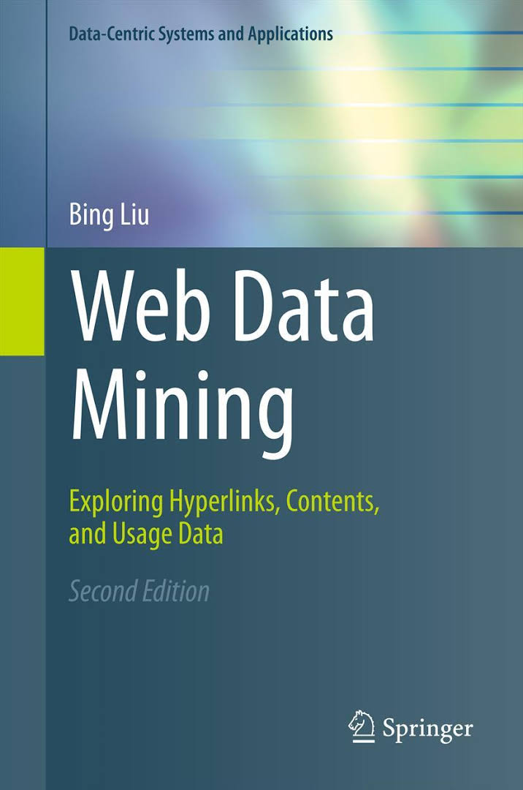

--- 
title: "Web Information Extraction and Retrieval"
author: "dr. Slavko Žitnik"
date: "`r format(Sys.Date(), '%A, %d. %B, %Y', tz='Europe/Ljubljana')`"
site: bookdown::bookdown_site
output: bookdown::gitbook
documentclass: book
bibliography: [literature.bib]
biblio-style: apalike
link-citations: yes
description: "Accompanying script to the Web Information Extraction and Retrieval course"
---

# About {-}

```{r figure-oil-rig, echo=FALSE, fig.align="center"}
knitr::include_graphics("img/book/oil-rig.png")
```

This book represents an accompanying material to the **Web Information Extraction and Retrieval** course at the [Faculty for computer and information science](http://www.fri.uni-lj.si/), [University of Ljubljana](http://www.uni-lj.si/).

## Course {-}

TODO: where and why is this course, who is lecturer/assistant

### Time plan {-}

TODO: Execution plan: time and place for lectures/lab; chapters; timing; moodle link

### Lectures {-}

TODO: Lectures description

### Lab {-}

TODO: Lab work description

* Lab plan for programming assignments:
    * PA1: crawler za portal https://e-uprava.gov.si in spletne strani ministrstev ter agencij
      * Quiz: poznavanje lastnosti crawler-jev
    * PA2: custom parsanje vsebine spletnih strani - tudi word in PDF dokumenti
    * PA3: indeksiranje vsebine oz. ustrezno shranjevanje
      * PA3a: posebna naloga za custom izdelavo indeksov
    * PA4: spletna aplikacija s poizvedovanjem - npr.: iskanje odgovorov na vprašanja
      * PA4a: learning to rank naloga

### Marking {-}

### Written exams {-}

Exam | Date
:---|:---
1. written exam | TBD
2. written exam | TBD
3. written exam | TBD

## Additional literature {-}

TODO: present book and connect to chapters

<table class="additionalSources">
<tr>
<td>

```{r fig-web-data-mining, echo=FALSE, out.width="200"}

```

</td>
<td>

* **Web Data Mining: Exploring Hyperlinks, Contents and Usage Data, 2<sup>nd</sup> edition** [@liu2011]
    * **Chapter 1**: Introduction 
    * ...
    * **Chapter 6**: Information Retrieval and Web Search
    * **Chapter 7**: Social Network Analysis
    * **Chapter 8**: Web Crawling
    * **Chapter 9**: Structured Data Extraction: Wrapper Generation
    * **Chapter 10**: Information Integration
    * ...
    * **Chapter 12**: Web Usage Mining

</td>
</tr>
</table>
