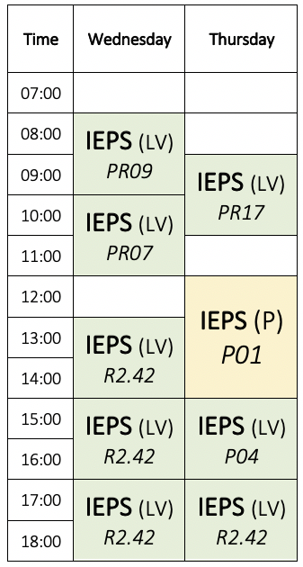

--- 
title: "Web Information Extraction and Retrieval"
author: "assist. prof. dr. Slavko Žitnik and prof. dr. Marko Bajec"
date: "`r format(Sys.Date(), '%A, %d. %B, %Y', tz='Europe/Ljubljana')`"
site: bookdown::bookdown_site
output: bookdown::gitbook
documentclass: book
description: "Instructions for the Web Information Extraction and Retrieval course labs"
---

# About the course {-}

```{r figure-oil-rig, echo=FALSE, fig.align="center"}

```

This script includes instructions for the lab work for the [**Web Information Extraction and Retrieval**](https://ucilnica.fri.uni-lj.si/course/view.php?id=284) course at the [Faculty for computer and information science](http://www.fri.uni-lj.si/), [University of Ljubljana](http://www.uni-lj.si/).

## Lab work {-}

The lab work in this course is consultation-like, so we do not check attendance. The assistant is available during the scheduled times and you can select the time to ask questions in person, while you are also encouraged to use [the course Slack channel](https://wier-fri.slack.com).

Timetable:

```{r timetable, echo=FALSE, fig.align="center"}

```


## Programming assignments {-}

* Programming assignment 1: Web crawling
    * <span style="text-decoration: line-through;">Tentative submission deadline: March 27, 2019 @ 6:00am</span>
    * Tentative submission deadline: April 3, 2019 @ 6:00am
  
* Programming assignment 2: Document parsing
    * Tentative submission deadline: April 24, 2019 @ 6:00am
  
* Programming assignment 3: Indexing & querying
    * Tentative submission deadline: May 22, 2019 @ 6:00am

## Grading and rules {-}

Each assigment is worth 100 points. Therefore, altogether 300 points. There will be bonus points available but the maximum points from the lab work are 300. For late submission, there will be penalty of 10 points per each late day. It will be possible to submit up to 5 days after the assignment deadline.

Lab work can be done in groups (preferably) of up to three students. Groups with two or a single member have the same pass conditions - they do not need to coordinate so much and are also more independent.

As a result of an assignment, a group needs to create a private Bitbucket repository and add a user *asistent* to the repository with at least read credentials. All the submissions will be subject to plagiarism check. **Groups that will copy the results or code from the others will be graded with zero points.**

After the submission of an assignment, all the submissions will be marked and each group will get a response. Randomly chosen groups will be selected to explain their solution and to show the execution in practice - each group will need to defend an assigment at least once during the course.


