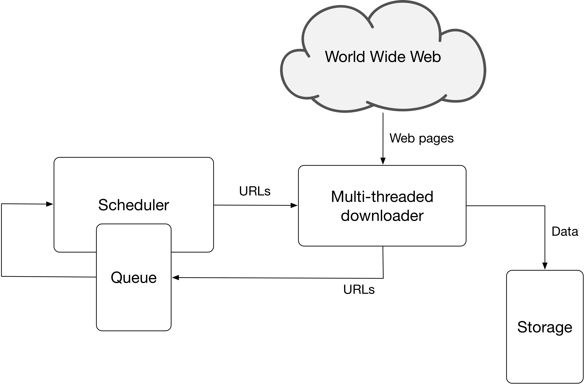

# Programming assignment 1 {#PA1}


## Introduction

The goal of this programming assignment is to build a standalone crawler that will crawl only *.gov.si* web sites. The crawler will roughly consist of the following components (Figure \@ref(fig:crawlerArchitecture)):

* HTTP downloader and renderer: To retrieve and render a web page.
* Data extractor: Minimal functionalities to extract images and hyperlinks.
* Duplicate detector: To detect already parsed pages.
* URL frontier: A list of URLs waiting to be parsed.
* Datastore: To store the data and additional metadata used by the crawler.

```{r crawlerArchitecture, out.width=500, echo=FALSE, fig.align="center", fig.cap="Web crawler architecture."}

```

## Instructions

Implement a web crawler that will crawl only *\*.gov.si* web sites. You can choose a programming language of your choice. The initial seed URLs should be: 

* *gov.si*,
* *spot.gov.si*,
* *e-uprava.gov.si* and
* *e-prostor.gov.si*.

> For the above given domains only (not other domains), [Apache Nutch](https://nutch.apache.org/) needs the following time:
>
> * HTTP retrieval without rendering:
>     + cca. 60min
>     + Retrieved around 7.000 pages at the level 14.
> * HTTP retrieval with rendering (Selenium - HTMLUnit):
>     + cca. 230min - 290min
>     + Retrieved around 3.000 pages.
>
> All the parameters are set to default settings (5s between requests to the same server, ...). Selenium/HTMLUnit protocol retrieves significantly less web pages due to problems in parsing *evem.gov.si* and *e-uprava.gov.si* web sites.


The crawler needs to be implemented with multiple workers that retrieve different web pages in parallel. The number of workers should be a parameter when starting the crawler. The frontier strategy needs to follow the breadth-first strategy. In the report explain how is your strategy implemented.

Check and respect the [*robots.txt*](https://en.wikipedia.org/wiki/Robots_exclusion_standard) file for each domain if it exists. Correctly respect the commands *User-agent*, *Allow*, *Disallow*, *Crawl-delay* and *Sitemap*. Make sure to respect *robots.txt* as sites that define special crawling rules often contain [spider traps](https://en.wikipedia.org/wiki/Spider_trap). Also make sure that you follow ethics and do not send request to the same server more often than one request in 5 seconds (not only domain but also IP!).

In a database store canonicalized URLs only!

During crawling you need to detect duplicate web pages. The easiest solution is to check whether a web page with the same page content was already parsed (hint: you can extend the database with a hash, otherwise you need compare exact HTML code). If your crawler gets a URL from a frontier that has already been parsed, this is not treated as a duplicate. In such cases there is no need to re-crawl the page, just add a record into to the table *link* accordingly.  

  * BONUS POINTS (10 points): Deduplication using exact match is not efficient as some minor content can be different but two web pages can still be the same. Implement one of the [Locality-sensitive hashing](https://en.wikipedia.org/wiki/Locality-sensitive_hashing) methods to find collisions and then apply Jaccard distance (e.g. using unigrams) to detect a possible duplicate. Also, select parameters for this method. Document your implementation and include an example of duplicate detection in the report. Note, you need to implement the method yourself to get bonus points.
  
When your crawler fetches and renders a web page, do some simple parsing to detect images and next links.

  * When parsing links, include links from *href* attributes and *onclick* Javascript events (e.g. *location.href* or *document.location*). Be careful to correctly extend the relative URLs before adding them to the frontier.
  * Detect images on a web page only based on *img* tag, where the *src* attribute points to an image URL.
  
Donwload HTML content only. List all other content (*.pdf*, *.doc*, *.docx*, *.ppt* and *.pptx*) in the *page_data* table - there is no need to populate *data* field (i.e. binary content). In case you put a link into a frontier and identify content as a binary source, you can just set its *page_type* to *BINARY*. The same holds for the image data.

In your crawler implementation you can use libraries that implement headless browsers but not libraries that already implement web crawler functionality. Therefore, some useful libraries that you can use are:

  * [HTML Cleaner](http://htmlcleaner.sourceforge.net/)
  * [HTML Parser](http://htmlparser.sourceforge.net/)
  * [JSoup](https://jsoup.org/)
  * [Jaunt API](https://jaunt-api.com/)
  * [HTTP Client](http://hc.apache.org/)
  * [Selenium](https://www.seleniumhq.org/)
  * [phantomJS](http://phantomjs.org/)
  * [HTMLUnit](http://htmlunit.sourceforge.net/)
  * etc.

On the other hand, you **MUST NOT** use libraries like the following:

  * [Scrapy](https://scrapy.org/)
  * [Apache Nutch](https://nutch.apache.org/)
  * [crawler4j](https://github.com/yasserg/crawler4j)
  * [gecco](https://github.com/xtuhcy/gecco)
  * [Norconex HTTP Collector](https://www.norconex.com/collectors/collector-http/)
  * [webmagic](https://github.com/code4craft/webmagic)
  * [Webmuncher](https://github.com/dadepo/Webmuncher)
  * etc.

To make sure that you correctly gather all the needed content placed into the DOM by Javascript, you should use headless browsers. Googlebot implements this as a two-step process or expects to retrieve dynamically built web page from an HTTP server. A nice session on crawling modern web sites built using JS frameworks, link parsing and image indexing was a part of Google IO 2018 and it is suggested for you to check it:

<center><iframe width="560" height="315" src="https://www.youtube.com/embed/PFwUbgvpdaQ" frameborder="0" allow="accelerometer; autoplay; encrypted-media; gyroscope; picture-in-picture" allowfullscreen></iframe></center>

<!--
Useful links
 https://www.elephate.com/blog/javascript-seo-experiment/ 
 https://searchengineland.com/tested-googlebot-crawls-javascript-heres-learned-220157
 https://webmasters.googleblog.com/
-->


Examples of enabling javascript in a web browser or not:

<table class="additionalSources">
<tr>
<td><center><b>Javascript enabled</b></center></td>
<td><center><b>Javascript disabled</b></center></td>
</tr>
<tr>
<td></td>
<td></td>
</tr>
<tr>
<td></td>
<td></td>
</tr>
</table>

In your implementation you must set the *User-Agent* field of your bot to *fri-wier-NAME_OF_YOUR_GROUP*.

### Crawldb design

Below there is a model of a crawldb database that your crawler needs to use. This is just a base model, which you **MUST NOT** change, but you can extend it with additional fields, tables, ... that your crawler might need. You should use PostgreSQL database and create a schema using a [prepared SQL script](data/pa1/crawldb.sql).

<center><iframe width="879" height="814" src="data/pa1/crawldb.html" frameborder="0" scrolling="no"></iframe></center>

Table *site* contains web site specific data. Each site can contain multiple web pages - table *page*. Populate all the fields accordingly when parsing. If a page is of type HTML, its content should be stored as a value within *html_content* attribute, otherwise (if crawler detects a binary file - e.g. .doc), *html_content* is set to *NULL* and a record in the *page_data* table is created. Available page type codes are *HTML*, *BINARY*, *DUPLICATE* and *FRONTIER*. The duplicate page should not have set the *html_content* value and should be linked to a duplicate version of a page. 

You can optionally use table *page* also as a current frontier queue storage. 

## Basic tools

We propose to run the notebook using an Anaconda environment. Prepare the environment as follows:

```bash
# Create and activate environment (activate it before each use)
conda create -n wier python=3.9
conda activate wier

# Install dependencies
conda install selenium psycopg2 nb_conda requests
conda install -c anaconda flask pyopenssl
conda install -c conda-forge flask-httpauth

# Run Jupyter notebook
jupyter notebook 
```

During the lab session we will present basic tools for those who are not well experienced in Web scraping and database access:

* Jupyter notebook tutorial [Web crawling - basic tools](notebooks/Web crawling - basic tools.ipynb) that introduces the basic tools to start working on the assignment.
* A showcase of server ([Remote crawler database (server)](notebooks/Remote crawler database (server).ipynb)) and client ([Remote crawler database (client)](notebooks/Remote crawler database (client).ipynb)) implementation in case you would like to run multiple crawlers (e.g. from each group member homes) and have the same crawler database.

## What to include in the report

The report should follow the [standard structure](https://fri.uni-lj.si/sl/napotki-za-pisanje-porocila). It must not exceed 2 pages. You can include extra pages if you need them for visualisations of the database.

In the report include the following:

* All the specifics and decisions you make based on the instructions above and describe the implementation of your crawler.
* Document also parameters that are needed for your crawler, specifics, problems that you had during the development and solutions.
* For the sites that are given in the instructions' seed list and also for the whole crawldb together (for both separately) report general statistics of crawldb (number of sites, number of web pages, number of duplicates, number of binary documents by type, number of images, average number of images per web page, ...). 
* Visualize links and include images into the report. If the network is too big, take only a portion of it or high-level representation (e.g. interconnectedness of specific domains). Use visualization libraries such as [D3js](https://d3js.org/), [visjs](http://visjs.org/), [sigmajs](http://sigmajs.org/) or [gephi](https://gephi.org/).

## What to submit

Only one of the group members should make a submission of the assignment in moodle. The submission should contain only a link to the repository that contains the following which you will use for all the submissions during the course:

 * a file *pa1/db*
 * a file *pa1/report.pdf* - PDF report.
 * a file *pa1/README.md* - Short description of the project and instructions to install, set up and run the crawler.
 * a folder *pa1/crawler* - Implementation of the crawler.

> **NOTE:** The database dump you submit should not contain images or binary data. Filename *db* should be of **Custom** export format that you can export directly using pgAdmin:
>
> <center></center>
> <center></center>
>
> The exported data file should not be larger than 100MB. If you get a larger file after exporting the database, please upload it to a cloud service like Google drive and include a text file with a link in your repository.
>
> For this assignment it is enough to retrieve data from 50.000 web pages in total (number of records in table *page* of type HTML from *.gov.si* domains).
 
<!--
## Grading schema

All the submissions will be manually graded by the assistant. Also, plagiarism check will be run across all the submissions. Grading will begin after the last late submission day. The submission time will be selected as the last commit time in the repository. 

The maximum score of 100 (+10 bonus points) will consist of the following:

Points | Item
------ | ----
20 | Database dump check (selected web pages, robots.txt compliance, rough number of web pages match)
30 | Crawler implementation details (multiple workers, BFS frontier, robots.txt and sitemap check, binary files saving, non-crawler libraries usage, javascript rendering)
10 | Duplicate detection (URL canonicalization, content matching)
10 | Duplicate detection (BONUS)
10 | Image and link detection (image tags and saving, HTML and JS)
20 | Retrieved pages analysis (statistics and visualization; justification of retrieved pages wrt. crawler running time)
10 | Submission compliance (report of work and issues description, readme instructions, source code availability - 0 points for the whole project if not available)

Selected groups will need to defend their work during the lab hours. If a group does not agree with their achieved score, it will be able to "negotiate"/defend their programming assignment submission.
-->
