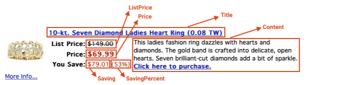

# Programming assignment 2 {#PA2}


## Introduction

The goal of this programming assignment is to implement three different approaches for the structured data extraction from the Web:

* (A) Using regular expressions
* (B) Using XPath
* (C) *RoadRunner*-like implementation

## Instructions

In [a compressed file](data/pa2/WebPages.zip) there are four web pages - two per Web site ([Overstock](https://www.overstock.com/), [Rtvslo.si](https://www.rtvslo.si/)). In Figure \@ref(fig:overStockSample) we define the names of the data items for a data record you will need to extract from *Overstock* sample web sites. The provided sample Web sites contain a list of data records, which all need to be processed. In Figure \@ref(fig:rtvSloSample) we also provide the names of the data items for the second sample web sites. In the provided *Rtvslo.si* example, there is only one data record per sample page.

```{r overStockSample, out.width=600, echo=FALSE, fig.align="center", fig.cap="Overstock.com Web page sample."}

```

```{r rtvSloSample, out.width=800, echo=FALSE, fig.align="center", fig.cap="RtvSlo.si Web page sample."}

```

Similarly to given Web pages above, find **your own two similar Web pages** (can be either list pages or detail pages from other domains than given ones) and define the names of the data items that you will  extract. The two Web pages **must** contain some same data item types with different values and a list of data items of different lengths. 

For each of the three types of the pages, implement the following:

(A) Data extraction using regular expressions only.
(B) Data extraction using XPath only.
(C) Generation of extraction rules using automatic Web extraction algorithm.

Input HTML files to these method should be pre-rendered.

The implementation must contain a file named *run-extraction.py* that can be run from command-line to test all the methods. The file should take one parameter as input - type of extracting algorithm (A, B, C). The script will be called as follows: `python run-extraction.py A`. Output should be written to standard output for all the Web pages.

The code must be run using python 3.6 and all the needed libraries must be listed in the README.md file. If you use any other language or Python version, you need to provide your own Docker image to run the scripts.

### Regular expressions implementation

For each given web page type implement a separate function that will take HTML code as input. The method should output extracted data in a JSON structured format to a standard output. Each data item must be directly extracted using a regular expression. Each data item must be extracted using only one regular expression and not more. But you can extract multiple data items using one regular expression (this might help you when extracting optional items in list pages). 

### XPath implementation

For each given web page type implement a separate function that will take HTML code as input. The method should output extracted data in a JSON structured format to a standard output. Each data item must be directly extracted using an XPath expression. If the extracted value should be further processed, use regular expressions or other techniques to normalize them.

### Automatic Web extraction algorithm implementation

Implement a method that will take two HTML web pages of the same type as input. The method should output a human-readable *wrapper* that could be used to extract data from a given type of web pages. The wrapper can be represented as *union-free regular expression* or any other format, based on which someone could implement a web data extractor. Web data extractor implementation is not needed for the purposes of this assignment.

You **must not** use code of the existing implementations but you can check it out or read related papers to get more in-depth knowledge if interested (not necessary for the purposes of this programming assignment). 

You can implement an algorithm of your choice. We propose to implement one of the following:

* *RoadRunner-like* implementation:
Follow the implementation guidelines presented at the lectures. Apart from the guidelines you can introduce various heuristics (e.g. taking tag attributes into account, additional rules, ...) that may help you with the wrapper generation. Also, you can implement some preprocessing steps prior to running the algorithm. It is expected, that the generated wrapper may miss some of the data items and may include other unrelevant data items in the output. You should comment or identify, which data items have not been recognized using the algorithm. Full implementation of the RoadRunner algorithm proposed in [the literature](http://www.dia.uniroma3.it/db/roadRunner/publications.html) is [available online along with some examples](http://www.dia.uniroma3.it/db/roadRunner/software.html). 

* *Webstemmer-like* implementation:
Follow the implementation guidelines of the [Webstemmer algorithm](http://www.unixuser.org/~euske/python/webstemmer/howitworks.html) and try to implement it on your own.

* Other implementations:
Try your own heuristics, ideas, ... Search the Internet for other existing automatic extraction techniques and implement an appropriate algorithm. 

## What to include in the report

The report should follow the [standard structure](https://fri.uni-lj.si/sl/napotki-za-pisanje-porocila).

In the report include the following:

* Description of the two selected web pages and identification of data items and data records (similarly as in the instructions above).
* Regular expressions implementation: a list of regular expressions that extract data from all the pages.
* XPath implementation: a list of XPath expressions that extract data from all the pages.
* Automatic Web extraction implementation: 
  * Pseudocode of your algorithm implementation and describtion of its implementation. Explain all the  rules or heuristics. Justify each inclusion of a rule or heuristics. Also cite the source of the idea if you re-implemented some feature from somewhere else (e.g. literature, full RoadRunner implementation).
  * Provide an output *wrapper* for each web page pair (i.e. three outputs). Each output should not exceed one A4 paper. 

## What to submit

Push your work into the same repository as you used for the first assignment. Structure the repository must comply with the following structure:

 * a file */report-extraction.pdf* - PDF report.
 * a file */README.md* - Short description of the project and instructions to install, set up and run all the methods.
 * a folder */implementation-extraction* - Implementation of the methods along with *run-extraction.py*. CAUTION: Use relative paths to files in your repository and take into account that script will be run within the *implementation-extraction* folder.
 * a folder */input-extraction* - All the three types of web pages that implemented methods can consume.
 
## Grading schema

All the submissions will be graded semi-automatically by the assistant. Plagiarism check will be run across all the submissions. Grading will begin after the last late submission day. The submission time will be selected as the last commit time in the repository. 

The maximum score of 100 will consist of the following:

Points | Item
------ | ----
10 | Selection of two similar Web pages
20 | Regular expressions and XPath implementation
30 | Automatic Web extraction implementation and description
30 | Reproducibility of your work (10 points per method)
10 | Submission compliance (report, readme instructions, repository structure)

Selected groups will need to defend their work during the lab hours. If a group does not agree with their achieved score, it will be able to "negotiate"/defend their programming assignment submission.


