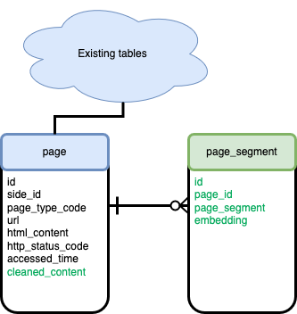

# Programming assignment 2 {#PA2}


## Introduction

The goal of this programming assignment is to extract useful information from the crawled websites and store it in a vector database for answering domain-specific questions. The assignment consists of three parts:

* (A) Identifying and extracting important information  
* (B) Storing information to a vector database  
* (C) Retrieving information relevant to the query  

## Identifying and extracting information

In this part of the assignment, your task is to identify meaningful content (such as article titles, product names, descriptions, prices, or publication dates) from HTML documents and extract it in a structured format. The goal is to prepare high-quality data that can later be stored in a vector database and queried effectively. You will explore two main techniques: XPath expressions and regular expressions.

### Using XPath expressions

One approach to navigate XML and HTML files is to use XPath expressions. XPath (XML Path Language) is a syntax for navigating through elements and attributes in an XML/HTML document tree.

XPath allows you to:

- Select nodes or node-sets in an XML document
- Navigate based on element names, attribute values, and hierarchy
- Perform conditional searches using predicates

**Basic XPath Syntax:**

- `/html/body/div` — selects a `div` element that is a child of `body`, which is a child of `html`
- `//p` — selects all `<p>` elements in the document
- `//div[@class="content"]` — selects all `<div>` elements with a class attribute equal to "content"
- `//a[@href]` — selects all anchor tags with an `href` attribute

**Python Example Using XPath:**

```python
from lxml import html

html_content = """
<html>
  <body>
    <div class="article">
      <h2>Sample Article</h2>
      <p>This is a test paragraph.</p>
    </div>
  </body>
</html>
"""

tree = html.fromstring(html_content)
title = tree.xpath('//div[@class="article"]/h2/text()')
print(title)  # Output: ['Sample Article']
```

### Using regular expressions

Another approach to content extraction is using **regular expressions** (regex). Regular expressions are powerful tools for pattern matching and text processing. While regex can be faster for small and well-structured tasks, it is more error-prone for messy or deeply nested HTML. Use it when you know the structure of the text you're working with and want to quickly extract specific elements.

**Basic Regex Syntax:**

- `.` — matches any character except newline  
- `*` — matches 0 or more repetitions  
- `+` — matches 1 or more repetitions  
- `?` — makes the preceding token optional  
- `[]` — matches any one character in the brackets  
- `()` — groups expressions  
- `\d` — matches any digit  
- `\s` — matches whitespace
- `^` — matches the start of a string
- `$` — matches the end of a string

**Common Regex Examples and What They Match:**

| Regular Expression     | Matches                                              |
|------------------------|------------------------------------------------------|
| `<h2>(.*?)</h2>`       | The text inside an `<h2>` tag                        |
| `href="(.*?)"`         | The value of an `href` attribute                     |
| `<p>(.*?)</p>`         | Paragraph content between `<p>` tags                 |
| `\d{4}-\d{2}-\d{2}`    | Dates in `YYYY-MM-DD` format                         |
| `\$[0-9]+\.[0-9]{2}`   | Dollar amounts like `$19.99`                         |
| `<[^>]+>`              | Any HTML tag                                         |

You can test your regular expressions expressions at [regexr.com](https://regexr.com/).

**Python Example Using Regular Expressions:**

```python
import re

html_content = """
<html>
  <body>
    <div class="article">
      <h2>Sample Article</h2>
      <p>Published on 2024-12-05</p>
      <p>Price: $19.99</p>
      <a href="https://example.com">Read more</a>
    </div>
  </body>
</html>
"""

# Extract article title
title = re.search(r'<h2>(.*?)</h2>', html_content)
print(title.group(1))  # Output: Sample Article

# Extract date
date = re.search(r'\d{4}-\d{2}-\d{2}', html_content)
print(date.group(0))  # Output: 2024-12-05

# Extract price
price = re.search(r'\$[0-9]+\.[0-9]{2}', html_content)
print(price.group(0))  # Output: $19.99

# Extract link
link = re.search(r'href="(.*?)"', html_content)
print(link.group(1))  # Output: https://example.com
```

Regular expressions can be concise and effective for small-scale, well-formatted content. However, for more complex HTML, tools like XPath (or HTML parsers like BeautifulSoup) are generally more reliable.

### Your task
You should use XPath and Regular expressions to filter the HTML websites you gathered in PA1.

1. Prepare a plain text version of the website where you remove static elements like website headers, menus, footers etc. while keeping the page's content.
2. Split the page into multiple thematic sections based on your judgment. You can use paragraphs, sentences, page sections, or any other indicator, with the goal of each section being a full description of one topic.


## Storing extracted information in a vector database

The second step of the assignment is to store the extracted information in a **vector database**. For this, you will expand the database you created in PA1 with a new table that stores **document segments** and their **vector representations**.

### Preparing the database

Make sure you are using a [pgvector database](https://github.com/pgvector/pgvector). Pgvector is a PostgreSQL extension that adds support for storing and indexing vector data. You can create a new pgvector database using the following command:

```bash
docker run --name postgresql-wier \
 -e POSTGRES_PASSWORD=SecretPassword \
 -e POSTGRES_USER=user \
 -e POSTGRES_DB=wier \
 -v $PWD/pgdata:/var/lib/postgresql/data \
 -v $PWD/init-scripts:/docker-entrypoint-initdb.d \
 -p 5432:5432 \
 -d pgvector/pgvector:pg16
```

In your database, enable the `vector` extension using the statement:

```sql
CREATE EXTENSION IF NOT EXISTS vector;
```

Once you have the database set up, add a new column to the `page` table to store **cleaned plain text content**, and create a new table to store **page segments** and their **vector embeddings**.



```sql
ALTER TABLE crawl_db.page ADD COLUMN cleaned_content TEXT;

CREATE TABLE crawl_db.page_segment (
  id serial NOT NULL,
  page_id integer,
  page_segment TEXT,
  embedding vector(768)
);

ALTER TABLE crawl_db.page_segment
  ADD CONSTRAINT fk_page_page_segment
  FOREIGN KEY (page_id)
  REFERENCES crawl_db.page(id)
  ON DELETE RESTRICT;
```

You are encouraged to extend the database schema with additional metadata fields that may be useful during retrieval — for example, the HTML tag, section title, heading level, or local context of a segment. If you do, describe these design decisions in your report.

### Generate vector embeddings

The next step is to generate **vector embeddings** for each page segment. Embeddings are fixed-length vector representations of text that capture its semantic meaning.

You should experiment with **different embedding models**, such as:

- `all-MiniLM-L6-v2` from [sentence-transformers](https://www.sbert.net/)
- OpenAI’s `text-embedding-ada-002`
- Hugging Face Transformers like `distilbert-base-uncased`
- Any domain-specific models relevant to your dataset (e.g. legal, medical)

The goal is that **similar queries and segments have similar embeddings** — so that when you compare a query embedding to the segment embeddings, you retrieve the most relevant content.

You can generate embeddings using Python libraries like `sentence-transformers`, `transformers`, or `openai`.

For each segment, compute its embedding and store it in the `embedding` column of the `page_segment` table.


## Information retrieval

In this part of the assignment, you will create a simple program that takes a **query** (for example, a user question) and retrieves the most relevant text segments from your database using **vector similarity search**.

You can use similarity operators provided by pgvector, such as:

- `<#>` Inner product (higher is more similar)
- `<=>` Cosine distance (lower is more similar)
- `<+>` L1 distance (lower is more similar)

**Your task is to experiment** with:

- Different **similarity metrics**
- Different **embedding models**
- Including or excluding **segment metadata** in your embeddings (e.g., including the title or section tag)
- **Chunking strategies** for segmenting the page (fixed-length? by paragraph? by heading?)

The goal is to find the **best combination for your domain**, so that given a query, your retriever consistently returns the most useful results.

You should implement a small Python demo program that:

1. Accepts a user query
2. Computes its embedding
3. Performs a similarity search over the segment embeddings in your database
4. Returns and displays the top-k most relevant segments

## What to submit

Push your work into the **same repository** as you used for the first assignment. The repository must comply with the following structure:

```
pa2/
├── report-extraction.pdf           # PDF report with description and evaluation
├── README.md                       # Setup instructions for running the code
├── implementation-extraction/      # Your implementation code (well documented)
│   └── demo.py                     # A demo script that allows us to test the retriever
├── extraction-db/                  # Your database including extracted segments and their embeddings
```

---

### What to include in the report

Your report should include the following:

* Information about how you performed website filtering
* How did you determine page the segments
* What embeddings did you decide to use, and why
* What similarity metric did you decide to use, and why
* Examples of queries and your retriever's responses
* Limitations of your document retriever (e.g. examples of queries with bad responses)

**Make sure to also describe methods you tried but decided not to use.**
